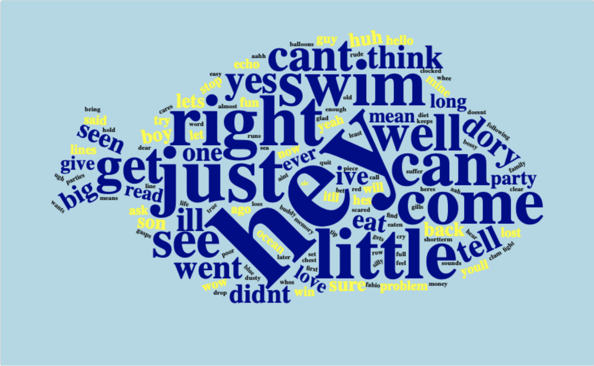
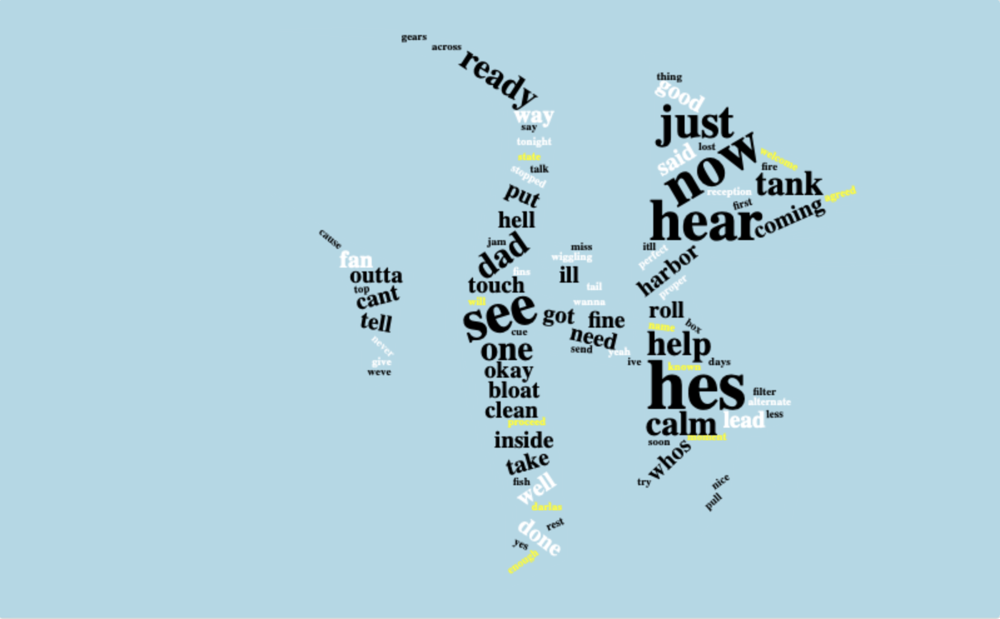
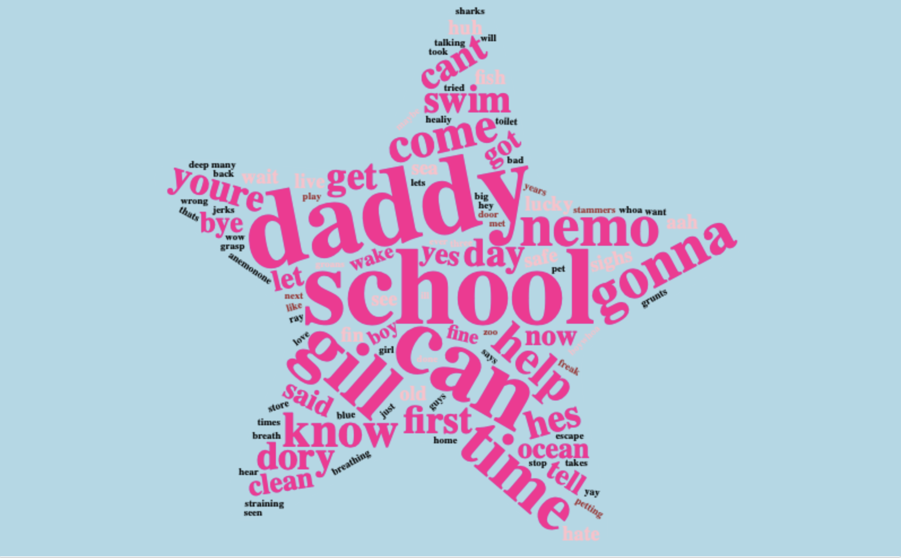

```{r setup, include = FALSE}
# Set code chunk defaults 
# Consider adding `message = FALSE` option
knitr::opts_chunk$set(echo = FALSE) 
                      
# Set R environment options
options(knitr.kable.NA = '')

# Load packages

library(tidyverse) # data manipulation
library(tm) # text mining
library(wordcloud) # word cloud generator
library(tidytext) # text mining for word processing and sentiment analysis
library(reshape2) # reshapes a data frame
library(radarchart) # drawing the radar chart from a data frame
library(knitr) # report generation
library(wordcloud2)
library(dplyr)
library(stringr)
library(rmdformats)

library(tidyr)
library(textdata)
library(igraph)
library(ggplot2)
library(ggnetwork)
library(scales)
```

# Intro

Welcome to "Beneath the Surface"! If you're a fan of the beloved Pixar classic, Finding Nemo, and are interested in analyzing the script using text analysis, you're in the right place. In this blog, we'll be taking a deep dive into the words spoken by each of the characters in the movie to uncover their personalities, motivations, and relationships with one another. Using text analysis tools, we'll be able to examine the language and patterns of speech of each character and draw insights about how they contribute to the overall narrative. Whether you're a fan of Marlin, Nemo, Crush, or any of the other lovable characters in this underwater adventure, "Beneath the Surface" is the place to be for a closer look at the story of Finding Nemo.

# Wordclouds

```{r shawn, include = FALSE}
data0 <- read_csv("data/Script_Finding_Nemo.csv")

marlin <- data0 %>%
  filter(name == "Marlin") %>% 
  mutate(line = str_replace_all(line, "[^[:alnum:][:space:]]", "")) %>%
  filter(!str_detect(line, "'"))

dory <- data0 %>%
  filter(name == "Dory") %>% 
  mutate(line = str_replace_all(line, "[^[:alnum:][:space:]]", "")) %>%
  filter(!str_detect(line, "'"))

gill <- data0 %>%
  filter(name == "Gill") %>% 
  mutate(line = str_replace_all(line, "[^[:alnum:][:space:]]", "")) %>%
  filter(!str_detect(line, "'"))

peach <- data0 %>%
  filter(name == "Nemo") %>% 
  mutate(line = str_replace_all(line, "[^[:alnum:][:space:]]", "")) %>%
  filter(!str_detect(line, "'"))

#cleanCorpus takes a corpus as an input and returns a cleaned version of it:

cleanCorpus <- function(corpus){

  corpus.tmp <- tm_map(corpus, removePunctuation) #Removes all punctuation from the corpus and saves the result to a temporary variable. 
  corpus.tmp <- tm_map(corpus.tmp, stripWhitespace) #Removes all leading and trailing whitespace from the corpus and saves the result.
  corpus.tmp <- tm_map(corpus.tmp, content_transformer(tolower)) #Converts all text in the corpus to lowercase.
  v_stopwords <- c(stopwords("english")) #Defines a vector v_stopwords that contains the default English stop words that should be removed from the corpus.
  corpus.tmp <- tm_map(corpus.tmp, removeWords, v_stopwords) # Removes all stop words from the corpus.
  corpus.tmp <- tm_map(corpus.tmp, removeNumbers) #Removes all numbers from the corpus.
  return(corpus.tmp) #Returns the cleaned version of the corpus as the output of the function.
}

# This function takes a text input and returns a data frame with the frequency count of the most common words in the text.
frequentTerms <- function(text){

  s.cor <- Corpus(VectorSource(text)) # Create a corpus object from the input text.
  s.cor.cl <- cleanCorpus(s.cor) # Clean the corpus by removing stop words and punctuation
  s.tdm <- TermDocumentMatrix(s.cor.cl) # Create a term-document matrix from the cleaned corpus.
  s.tdm <- removeSparseTerms(s.tdm, 0.999) # Remove sparse terms from the term-document matrix.
  m <- as.matrix(s.tdm) # Convert the term-document matrix to a regular matrix.
  word_freqs <- sort(rowSums(m), decreasing=TRUE) # Calculate the frequency count for each word in the matrix and sort them in descending order.
  dm <- data.frame(word=names(word_freqs), freq=word_freqs) # Create a data frame with the word and frequency count columns.
  return(dm)

}

top.movie.chars <- as.data.frame(sort(table(data0$name), decreasing=TRUE))[1:20,]
```

## Top Characters

```{r topchars}
ggplot(data=top.movie.chars, aes(x=Var1, y=Freq)) +
  geom_bar(stat="identity", fill="lightblue", colour="black") +
  theme_bw() +
  theme(axis.text.x=element_text(angle=45, hjust=1)) +
  labs(x="Character", y="Number of Lines")
```

## Marlin 

```{r marlin, warning=FALSE}
marlinwc <- wordcloud2(frequentTerms(marlin$line), 
           size=1,
           color = c(rep("orange", 40), rep("white", 30), rep("black", 1)),
           backgroundColor = "lightblue",
           figPath="png/marlin4.pmng.png")
```

```{r}
library(htmlwidgets)
saveWidget(marlinwc, "marlinwc.html", selfcontained = F)
```

Marlin, the overprotective clownfish and father of Nemo, is the main character in Pixar's Finding Nemo. 

One of Marlin's most frequently used words is "son," which reflects his deep love and concern for Nemo. He is constantly worried about his son's safety, and his use of the word "son" reinforces this central theme. His use of "look" also reflects his hyper-awareness of his surroundings and his need to stay vigilant to keep his son safe. One interesting finding is Marlin's use of the word "boat", which could reflect his fear of human world and his desire to save Nemo from it.

Marlin's less frequent but important use of words like "coral" and "kids" reveals more about his relationships with other characters in the movie. His use of "coral" reflects his attachment to his home and community, while his use of "kids" reveals his connection to other parents from whom he receives advice, such as Crush, the sea turtle.

## Dory

```{r dory, eval=FALSE, warning=FALSE, include=FALSE}
wordcloud2(frequentTerms(dory$line), 
           size=1,
           color = c(rep("darkblue", 30), rep("yellow", 30), rep("black", 1)),
           backgroundColor = "lightblue",
           figPath="png/dory5.png")
```

```{r}

```


Dory is undoubtedly one of the most beloved characters in Finding Nemo, known for her famous catchphrase "just keep swimming." 

One of the most frequently used words in Dory's vocabulary is "swim", which reflects her natural inclination to explore. It also serves as a metaphor for her philosophy on life, which is to keep moving forward no matter what obstacles may arise. Dory also frequently uses the word "can't". This reflects her lack of confidence, as well as her tendency to give up when faced with a challenge. However, it also serves to highlight her growth throughout the movie, as she learns to believe in herself and her abilities. Another word that is less frequently used but still important to Dory's character is her own name, "Dory," which she uses as a form of self-identification and self-affirmation. 

## Gill {.active}

```{r gill, eval=FALSE, warning=FALSE, include=FALSE}
wordcloud2(frequentTerms(gill$line), 
           size=1,
           color = c(rep("black", 30), rep("white", 20), rep("yellow", 10)),
           backgroundColor = "lightblue",
           figPath="png/gill2.png")
```

```{r}

```


Gill is the leader of the Tank Gang.

One of his most frequently used words is "calm." When the group is trying to figure out how to escape from the dentist's office, Gill tells them to "stay calm" and not panic. This shows that Gill is a natural leader who is able to keep a level head in stressful situations, and that he is concerned about the well-being of his fellow fish.

The word "lead" is also important in understanding Gill's character. While it is not one of his most frequently used words, it does appear several times throughout the movie. For example, when the Tank Gang is trying to get out of the plastic bags, Gill tells Nemo to "lead the way." This shows that Gill is not only a leader, but also recognizes leadership qualities in others. He is able to delegate tasks and trust others to take charge when needed.

## Peach

```{r peach, eval=FALSE, warning=FALSE, include=FALSE}
wordcloud2(frequentTerms(peach$line), 
           size=2,
           color = c(rep("deeppink", 30), rep("pink", 20), rep("brown", 10)),
           backgroundColor = "lightblue",
           figPath="png/peach4.png")
```

```{r}

```


Peach is one of the supporting characters in the movie "Finding Nemo." She is a pink starfish who lives in the tank in the dentist's office where Nemo is taken after being captured in the wild. Throughout the movie, Peach is shown to be a loyal and caring friend to the other inhabitants of the tank, particularly Gill, who is the de facto leader of the group.

A text analysis of Peach's dialogue reveals that she frequently mentions both Gill and Nemo, which suggests that these two characters are important to her. Peach often talks about Gill in relation to his plans to escape from the tank, showing her admiration for his leadership skills and bravery. 

# Sentiment Analysis

Sentiment Analysis involves analyzing the overall "feel" of a body of text. We wanted to see what the overall sentiments of the main characters were using two common sentiment databases: the AFINN Lexicon and the NRC Lexicon. While these lexicons enable powerful analysis of character's general sentiments, they are unfortunately not comprehensive and many of the words in Finding Nemo did not appear in either lexicon. 


```{r, include = FALSE}
data <- read_csv("data/Script_Finding_Nemo.csv")
afinn_lexicon <- get_sentiments("afinn")
nrc_lexicon <- get_sentiments("nrc")

character_word_freqs <- data %>% 
  #Filter out irrelevant characters like "Scene 1" or "Turtle 1"
  filter(!str_detect(name, "\\d")) %>%
  #Get individual words said by characters
  unnest_tokens(output = word, input = line) %>%
  #Remove irrelevant words
  anti_join(stop_words, by="word") %>%
  #Count the number of times each character says each word
  group_by(name) %>%
  count(word, sort = TRUE)
  
character_sentiments <- character_word_freqs %>%
  #Get the sentiments of each word
  inner_join(afinn_lexicon, by = "word") %>%
  #Get the average sentiments of the characters, and only take the top ten characters with most words spoken
  summarize(avg_sentiment = (sum(n*value) / (sum(n))), total_words = sum(n)) %>%
  #Top 10 characters by number of afinn-lexicon words said
  arrange(desc(total_words)) %>%
  head(10)


character_word_counts <- character_word_freqs %>% 
  #Only get words in the nrc lexicon
  inner_join(nrc_lexicon %>% 
               select(word) %>% 
               distinct(), by = "word") %>% 
  #get total number of words said
  group_by(name) %>% 
  summarize(total_words = sum(n)) %>%
  #Top 6 characters by words said
  arrange(desc(total_words)) %>%
  head(6)

percent_per_sentiment <- character_word_freqs %>% 
  #Get word sentiments
  inner_join(nrc_lexicon, by = "word") %>% 
  #Get total words said
  inner_join(character_word_counts, by = "name") %>%
  group_by(name, sentiment) %>% 
  #Calculate percentage of words with that sentiment, using first to remove duplicate fields due to each name-sentiment combination having its own total_words field
  summarize(sentiment_percentage = sum(n)/first(total_words), total_words = first(total_words)) %>% 
  #Get the top 5 sentiments per character
  group_by(name) %>%
  arrange(desc(sentiment_percentage)) %>%
  slice(1:5)


```

## AFINN Sentiments

The AFINN lexicon assigns each word a number from -5 to 5 according to how "negative" or "positive" a connotation it contains. We averaged these scores across all of the words said by each character, and calculated an average sentiment for each character on a scale of -5 to 5. For simplicity, we count the number of AFINN lexicon words said by each character, and only display the top 10 characters by total AFINN words said

```{r}
#Barplot the average sentiments of the characters, sorted with the most verbose character on the left
ggplot(data = character_sentiments, aes(x = reorder(name, -total_words), y = avg_sentiment)) +
  geom_bar(stat = "identity") + 
  labs(x = "Character", 
       y = "Average Sentiment",
       title = "Average Sentiments of Characters in Finding Nemo",
       subtitle = "Characters displayed in order of most to least words from left to right")
```

From these results, we can see that most characters are on average fairly positive. This makes sense given Finding Nemo's status as a PG movie intended for children. Of these characters, Peach and Crush have very positive average sentiments, which tracks with their personalities. Peach, the pink starfish, is a big-sister type character, helping Nemo when he first enters the dentist's tank. With her positive encouragement and protection, Peach's dialogue is overall very positive. On the other hand, Crush is a surfer dude type character, and his carefree lifestyle leads to largely positive dialogue. Finally, the one character with a negative overall sentiment is Bloat, the pufferfish. Bloat starts off by scaring Nemo when he first enters the dentist's office, and throughout the film is generally short-tempered and anxious, leading to an overall negative sentiment.

## NRC Sentiments

In contrast to the AFINN lexicon, the NRC lexicon categorizes words into different sentiment categories such as anticipation, fear, or joy, allowing for one word to exist in multiple categories. In this analysis, we count the number of words in each character's dialogue associated with each sentiment category, and display the top 5 sentiments in each character's dialogue. As this analysis is more complex, we only include the top 6 characters by total NRC words said.


```{r}
#Plot the top 5 sentiments for each character 
ggplot(data = percent_per_sentiment,
       #Arrange sentiments by how common they are in that character's dialogue
       aes(x = fct_reorder(sentiment, sentiment_percentage), 
           y = sentiment_percentage, fill = name)) +
  geom_col(show.legend = FALSE) +
  facet_wrap(~name, ncol = 2, scales = "free") +
  labs(x = NULL,
       y = "Percentage of words with sentiment",
       title = "Top five sentiments for each character",
       subtitle = "Displays top six characters by total words said"
       ) +
  coord_flip() +
  theme(axis.text = element_text(size = 5),
        strip.text.x = element_text(size = 5))   
```

As before, we can see that Crush's dialogue is mostly positive, with over half of his words belonging to that category. Unfortunately, due to the large number of words that fit into the broad categories of "positive" and "negative," these sentiment categories figure prominently in each character's dialogue. 

# Network Centrality


```{r, include = FALSE}

#Top 10 characters by total words said
character_words <- character_word_freqs %>%
  #Get the number of words said
  group_by(name) %>%
  summarize(n=sum(n)) %>%
  #Top 10 characters
  arrange(desc(n)) %>%
  head(10)

#Get the number of interactions between each pair of characters
interactions <- data %>% 
  #Get all characters that spoke adjacent to each other in the script
  select(name) %>% mutate(name1 = lag(name)) %>% 
  #Inner join to only select the dialogues between characters in the top 10 by total words said
  inner_join(character_words, by="name") %>%
  inner_join(character_words, by=c("name1"="name")) %>%
  select(name, name1) %>%
  drop_na() %>% 
  #Get the total number of interactions between each pair of characters
  group_by(across(c(name, name1))) %>% 
  summarize(n = n()) %>% 
  #Make into an igraph
  igraph::graph_from_data_frame(directed=FALSE) 


#Calculate the degree and strength of each character in the network
nemo_stats <- tibble(name = vertex_attr(interactions, "name")
                    , degree = degree(interactions)
                    , strength = strength(interactions
                                          , weights = edge_attr(interactions, "n")))
  

  
```

## Character Interactions
```{r, warning = FALSE}
#Plot the network of interactions, with color and size of edges corresponding to the number of interactions
ggplot(data=interactions %>% ggnetwork()
       , aes(x = x, y = y, xend = xend, yend = yend)) +
  geom_edges(curvature = 0.3,
             angle = 30,
             aes(color = n,
                 linewidth = n)) +
  scale_color_continuous(type = "viridis"
                         , labels = label_number()) +
  geom_nodes(size=5) +
  geom_nodelabel(aes(label = name)) +
  labs(title = "Pairwise Interactions in Finding Nemo",
       color = "Number of interactions",
       size = "Number of interactions") +
  theme_blank() +
  theme(legend.position = "bottom", legend.box="vertical") + 
  guides(size = "none")
```

## Character Centrality

```{r}
#Plot the strength of each character in the network
ggplot(data = nemo_stats, aes(x = name, y = strength)) + 
  geom_bar(stat = "identity") + 
  labs(x = "Character Name", 
       y = "Strength Centrality",
       title = "Strength Centrality of Finding Nemo Characters",
       subtitle = "Displays top 10 characters by total words said")
```
  

# References

<!-- Dataset -->
Trindade, Ash. (July 2022), "Finding Nemo Movie Script", *Kaggle*, available at <https://www.kaggle.com/datasets/ashtrindade/finding-nemo-movie-script>.

<!-- R packages -->
Wickham H, Averick M, Bryan J, Chang W, McGowan LD, François R, Grolemund G, Hayes A, Henry L, Hester J, Kuhn
  M, Pedersen TL, Miller E, Bache SM, Müller K, Ooms J, Robinson D, Seidel DP, Spinu V, Takahashi K, Vaughan D,
  Wilke C, Woo K, Yutani H (2019). “Welcome to the tidyverse.” _Journal of Open Source Software_, *4*(43), 1686.
  doi:10.21105/joss.01686 <https://doi.org/10.21105/joss.01686>.
  
Feinerer I, Hornik K (2022). _tm: Text Mining Package_. R package version 0.7-10,
  <https://CRAN.R-project.org/package=tm>.
  
Fellows I (2018). _wordcloud: Word Clouds_. R package version 2.6,
  <https://CRAN.R-project.org/package=wordcloud>.
  
Silge J, Robinson D (2016). “tidytext: Text Mining and Analysis Using Tidy Data Principles in R.” _JOSS_,
  *1*(3). doi:10.21105/joss.00037 <https://doi.org/10.21105/joss.00037>,
  <http://dx.doi.org/10.21105/joss.00037>.
  
Hadley Wickham (2007). Reshaping Data with the reshape Package. Journal of Statistical Software, 21(12), 1-20.
  URL http://www.jstatsoft.org/v21/i12/.
  
Ashton D, Porter S (2016). _radarchart: Radar Chart from 'Chart.js'_. R package version 0.3.1,
  <https://CRAN.R-project.org/package=radarchart>.
  
Yihui Xie (2023). knitr: A General-Purpose Package for Dynamic Report Generation in R. R package version 1.42.

Lang D (2023). _wordcloud2: Create Word Cloud by htmlWidget_. R package version 0.2.2,
  <https://github.com/lchiffon/wordcloud2>.  

Wickham H, François R, Henry L, Müller K (2022). _dplyr: A Grammar of Data Manipulation_. R package version
  1.0.10, <https://CRAN.R-project.org/package=dplyr>.
  
Wickham H (2022). _stringr: Simple, Consistent Wrappers for Common String Operations_. R package version
  1.5.0, <https://CRAN.R-project.org/package=stringr>.
  
Barnier J (2022). _rmdformats: HTML Output Formats and Templates for 'rmarkdown' Documents_. R package version
  1.0.4, <https://CRAN.R-project.org/package=rmdformats>.
  
Wickham H, Girlich M (2022). _tidyr: Tidy Messy Data_. R package version 1.2.1,
  <https://CRAN.R-project.org/package=tidyr>.
  
Hvitfeldt E (2022). _textdata: Download and Load Various Text Datasets_. R package version 0.4.4,
  <https://CRAN.R-project.org/package=textdata>.
  
Csardi G, Nepusz T: The igraph software package for complex network research, InterJournal, Complex Systems
  1695. 2006. https://igraph.org

H. Wickham. ggplot2: Elegant Graphics for Data Analysis. Springer-Verlag New York, 2016.  

Briatte F (2021). _ggnetwork: Geometries to Plot Networks with 'ggplot2'_. R package version 0.5.10,
  <https://CRAN.R-project.org/package=ggnetwork>.
  
Wickham H, Seidel D (2022). _scales: Scale Functions for Visualization_. R package version 1.2.1,
  <https://CRAN.R-project.org/package=scales>.